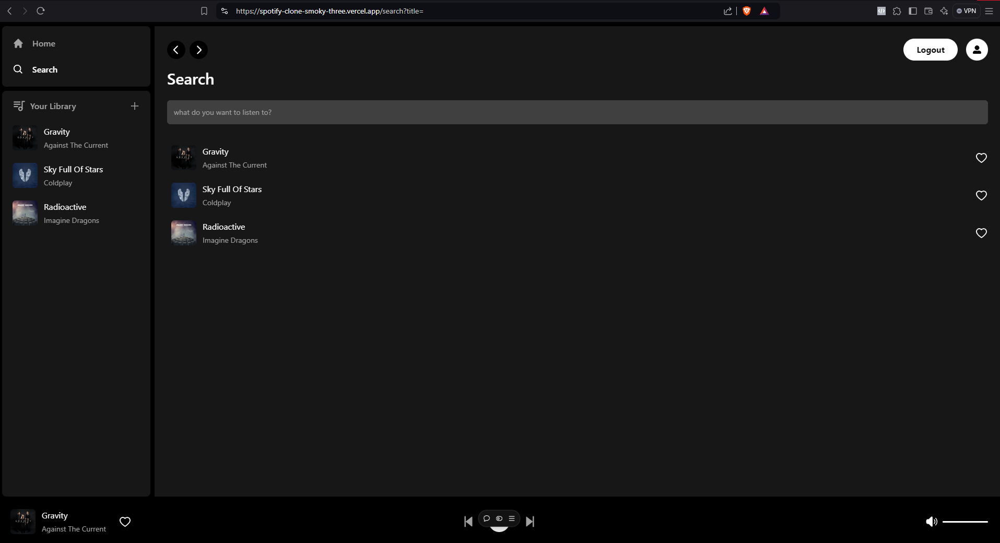

# Getting Started (Localhost)

First, you will need to use the `./template.env.local` to create a `./.env.local` file with the apropriate credentials for `Supabase` and `Stripe`.

## Run Development Server Locally (Required)

In a terminal run:

```bash
npm run dev
```

Open [http://localhost:3000](http://localhost:3000) with your browser to see the result.

**_Screenshot Site Page_**

**_Screenshot Search Page_**

**_Screenshot Account Page_**

**_Screenshot Auth Modal_**

**_Screenshot Subscribe Modal_**

**_Screenshot Upload Modal_**


## Run Integration with Stripe (Required)

Open another terminal run:

```bash
stripe login
```

Follow instructions to validate CLI session. Then run the following command to enable the webhooks:

```bash
stripe listen --forward-to localhost:3000/api/webhooks
```

# Supabase Configurations

Create an **Account** in [Supabase](https://supabase.com/dashboard/sign-in).

Create a new **Project**.

Save your **Supabase credentials** into the `.env.local` file (NOT THE ~~`template.env.local`~~)

You will need to create the following **tables**:

```
create table
  public.users (
    id uuid not null,
    full_name text null,
    avatar_url text null,
    billing_address jsonb null,
    payment_method jsonb null,
    constraint users_pkey primary key (id),
    constraint users_id_fkey foreign key (id) references auth.users (id)
  ) tablespace pg_default;
```

```
create table
  public.customers (
    id uuid not null,
    stripe_customer_id text null,
    constraint customers_pkey primary key (id),
    constraint customers_id_fkey foreign key (id) references auth.users (id)
  ) tablespace pg_default;
```

```
create table
  public.songs (
    id bigint generated by default as identity not null,
    created_at timestamp with time zone not null default now(),
    title text null,
    song_path text null,
    image_path text null,
    author text null,
    user_id uuid null,
    constraint songs_pkey primary key (id),
    constraint songs_user_id_fkey foreign key (user_id) references users (id) on update cascade on delete cascade
  ) tablespace pg_default;
```

```
create table
  public.liked_songs (
    user_id uuid not null,
    created_at timestamp with time zone not null default now(),
    song_id bigint not null,
    constraint liked_songs_pkey primary key (user_id, song_id),
    constraint liked_songs_song_id_fkey foreign key (song_id) references songs (id) on update cascade on delete cascade,
    constraint liked_songs_user_id_fkey foreign key (user_id) references users (id) on update cascade on delete cascade
  ) tablespace pg_default;
```

```
create table
  public.products (
    id text not null,
    active boolean null,
    name text null,
    description text null,
    image text null,
    metadata jsonb null,
    constraint products_pkey primary key (id)
  ) tablespace pg_default;
```

```
create table
  public.prices (
    id text not null,
    product_id text null,
    active boolean null,
    description text null,
    unit_amount bigint null,
    currency text null,
    type public.pricing_type null,
    interval public.pricing_plan_interval null,
    interval_count integer null,
    trial_period_days integer null,
    metadata jsonb null,
    constraint prices_pkey primary key (id),
    constraint prices_product_id_fkey foreign key (product_id) references products (id),
    constraint prices_currency_check check ((char_length(currency) = 3))
  ) tablespace pg_default;
```

```
create table
  public.subscriptions (
    id text not null,
    user_id uuid not null,
    status public.subscription_status null,
    metadata jsonb null,
    price_id text null,
    quantity integer null,
    cancel_at_period_end boolean null,
    created timestamp with time zone not null default timezone ('utc'::text, now()),
    current_period_start timestamp with time zone not null default timezone ('utc'::text, now()),
    current_period_end timestamp with time zone not null default timezone ('utc'::text, now()),
    ended_at timestamp with time zone null default timezone ('utc'::text, now()),
    cancel_at timestamp with time zone null default timezone ('utc'::text, now()),
    canceled_at timestamp with time zone null default timezone ('utc'::text, now()),
    trial_start timestamp with time zone null default timezone ('utc'::text, now()),
    trial_end timestamp with time zone null default timezone ('utc'::text, now()),
    constraint subscriptions_pkey primary key (id),
    constraint subscriptions_price_id_fkey foreign key (price_id) references prices (id),
    constraint subscriptions_user_id_fkey foreign key (user_id) references auth.users (id)
  ) tablespace pg_default;
```

# Stripe Configurations

Create a [Stripe Account](https://dashboard.stripe.com/register).

I suggest using a **Test Sandbox** for development. Heads-up: everything created in a sandbox (Customers, Products, Transactions, API Keys, Webhooks,...) are created completely separate from Live environment (and even Test environment).

Save your **Stripe credentials** into the `.env.local` file (NOT THE ~~`template.env.local`~~)

When configuring the **Stripe Webhook**, you will need to save the **Stripe webhook secret** into the `.env.local` file. Make sure that it is from the same environment (Sandbox, Test, Live) as the **API KEY**. If deploying in production (like in Vercel) you may need to configure the **webhook endpoint URL** (like: https://~~my-personal-domain~~.vercel.app/api/webhooks)

# Deploy using Vercel

Deploying in [Vercel](https://vercel.com/login) should be pretty straightforward.

Configure the apropriate **Environment Variables** in **Vercel** that you should be using in `.env.local` **locally**. If in production you may need to create **Live credentials** in **Stripe**.

You will need the **domain in production** from **Vercel** in order to configure the correct **webhook endpoint URL** from **Stripe**.
